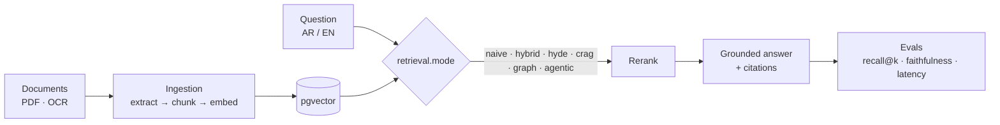
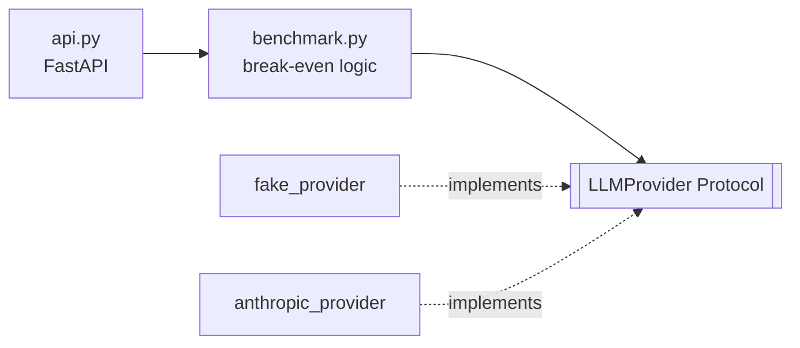

[All previews](../README.md) · [1 Minimal](1-minimal.md) · [2 Code](2-code.md) · [3 AI lab](3-ai-lab.md) · [4 Modern](4-modern.md) · **5 Case studies** · [6 Dashboard](6-dashboard.md)

---

## Mouiad Ali

Backend engineer (Python, Django), moving into AI engineering. I care about one thing in every system: the dependency arrows point one way.

---

### RAG-Lab: a RAG platform where every technique is a switch

**Problem.** RAG advice is mostly opinion. Hybrid search, HyDE, reranking, and CRAG all claim to help, but rarely with numbers on your own documents.

**Approach.** One config file drives six retrieval modes. A golden-set eval scores every configuration on recall@k, faithfulness, and latency. LLMs and embeddings sit behind ports, so providers can be swapped.

**Result.** Each technique has to earn its place by moving a number. → [Repo](https://github.com/Mouiad-dev/RAG-Lab)

---

### prompt-cache-benchmark: when caching pays off

**Problem.** Prompt caching isn't free. Writing to the cache costs 1.25×, and each read costs 0.1×. A short-lived agent can lose money on it.

**Approach.** Run a real workload N times and compute cumulative break-even from the API's actual `usage` numbers. The provider sits behind a `Protocol`, so tests use a fake that's free and deterministic.

**Result.** It reports negative savings when caching loses money, rather than always claiming a win. → [Repo](https://github.com/Mouiad-dev/prompt-cache-benchmark)

---

### Day job: insurance platform backends

Policy, quotation, and payment flows in Django + DRF. That means service layers, domain events (`PolicyIssued`, `InvoiceGenerated`), strict schema constraints, and N+1 hunting with `select_related` / `prefetch_related`.

---

[Email](mailto:mouiad.ali.work@gmail.com) · [More experiments](https://github.com/Mouiad-dev?tab=repositories) · [Older projects (2020–2022)](https://github.com/Mouiad-JRA)
